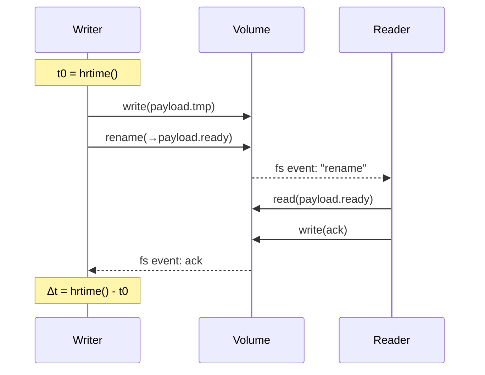
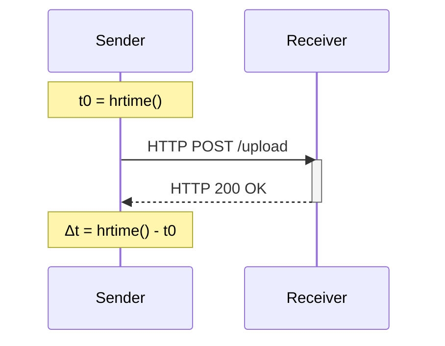

# K8s, Helm, Rancher

This is a documentation of my path in exploring, experimenting and learning Kubernetes (K8s), Helm, and Rancher.

## 1. Introduction
- follow https://kubernetes.io/docs/tutorials/
- ways of running k8s: minikube, kind, kubeadm
- start with minikube for local testing
- kubectl to communicate with k8s cluster 
- deploy fullstack app to local k8s cluster

### Notes:
- deployment: manages an instance of an application, ensures desired state inside the cluster
- service: exposes deployment to external network
    - allows for pods to die and be recreated without affecting access to the application because it routes traffic and abstracts away the pods
- pod: group of one or more application containers, it includes shared storage, IP address and information about how to run.
    - Containers should only be scheduled together in a single Pod if they are tightly coupled and need to share resources such as disk.
- configMap: used to store non-confidential data in key-value pairs.
    - as volumes updates on pull
    - as env vars only updates on restart of pod
- minikube needs a tunnel to expose services with type LoadBalancer

## 2. Testing Service Communication

The Goal is to Measure and compare service communication in Kubernetes using two approaches:

- Services in separate Pods communicating over the network via a ClusterIP Service.
- Service containers in one Pod communicating via the filesystem.

[//]: # (Visualization: [Figma]&#40;https://www.figma.com/board/sQk6dhJdW9P3uDKgH0IYtA/k8s-Testing?node-id=0-1&t=R43z4tdKJkp8gHjj-1&#41;)

Setup shared vol:

setup network:

To Measure this the data for benchmarking will be doubled for every iteration.

add more metrics:
- latency
- throughput
- cpu
- memory
- i/o
- bytes transferred

Also interesting would be to look into what happens during failures, scaling and rollouts.

## questions

What data will I use?
- repeated character x, maybe change to random later
- format: text
- size steps: 64 B, 1 KiB, 2 KiB, 4 KiB, 8 KiB, ...
  … 512 KiB, 1 MiB, 2 MiB, 4 MiB, 8 MiB, 16 MiB 

Validity of data:
- timing on different nodes might drift

## Common issues:
image not found:
eval $(minikube docker-env)