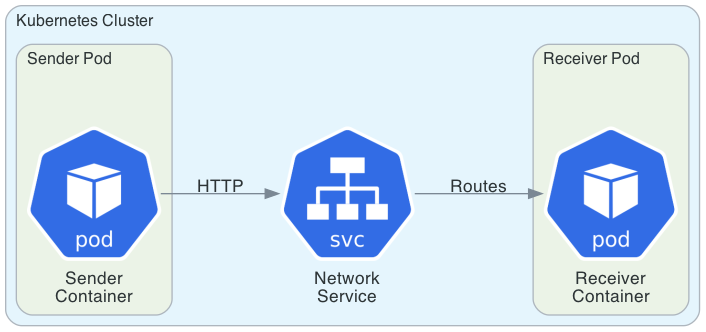
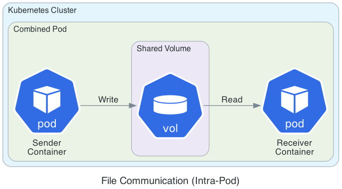
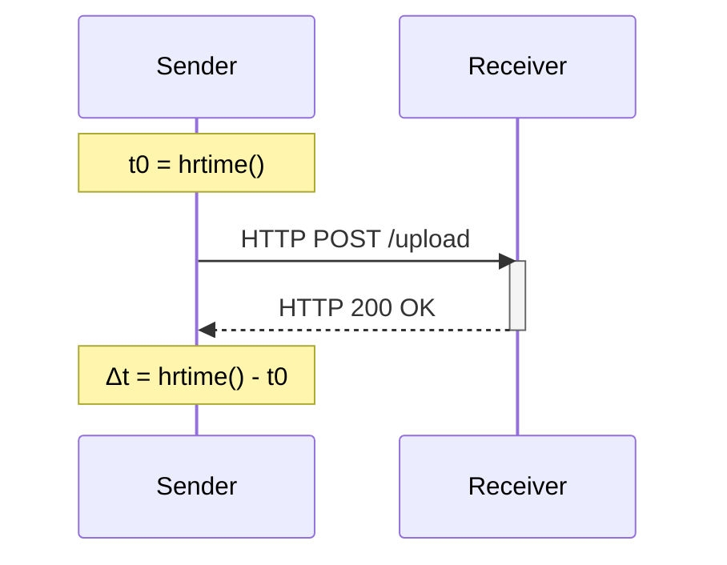
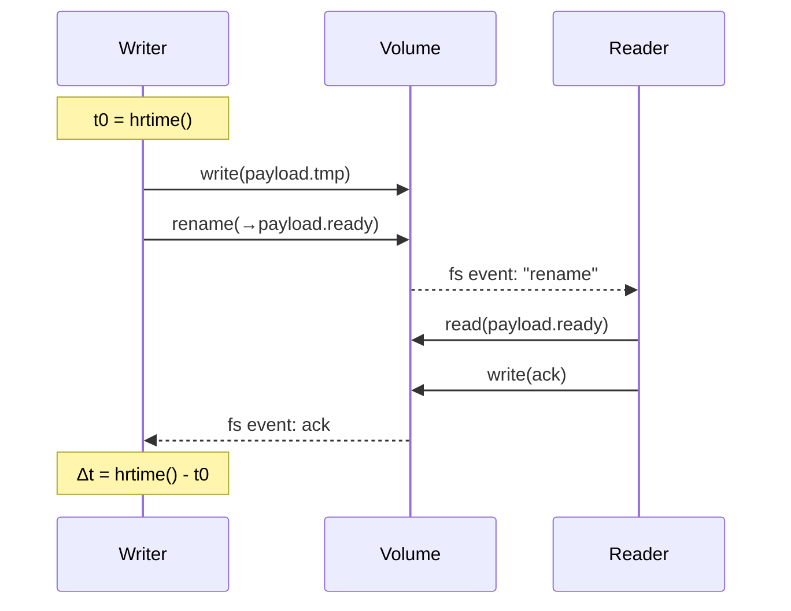
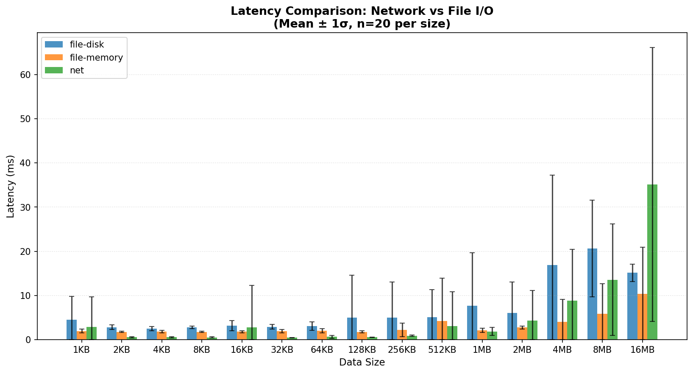
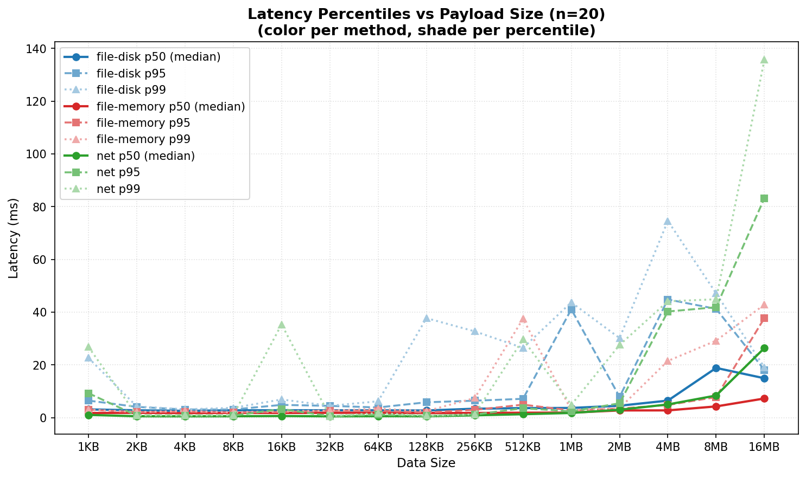
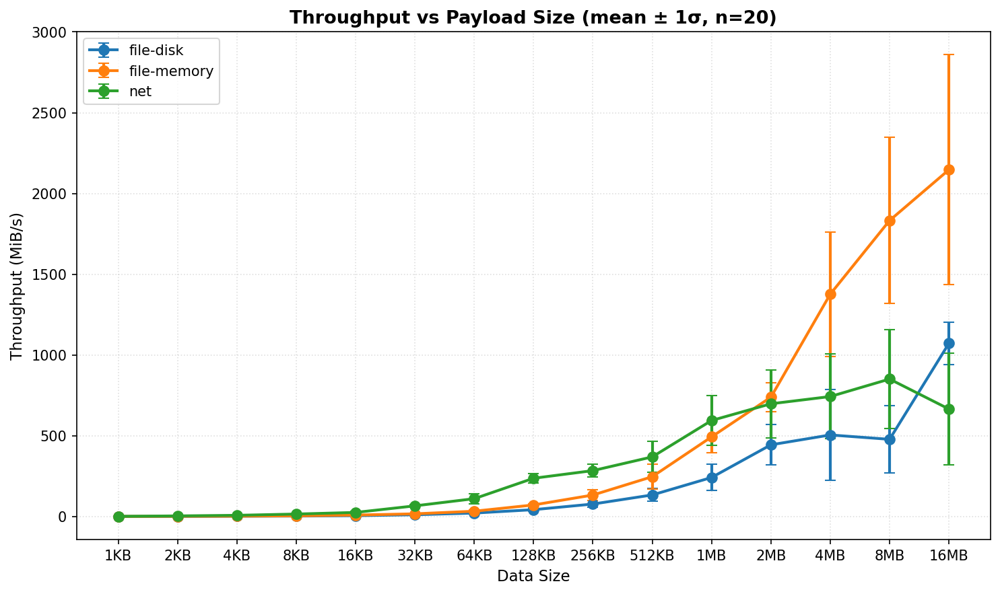

# Kubernetes Service Communication Benchmark

Benchmark comparing service communication methods in Kubernetes:
- **Network**: HTTP communication via ClusterIP Service
- **File I/O (disk)**: Shared emptyDir volume on disk
- **File I/O (memory)**: Shared emptyDir volume in memory

## Architecture

### Kubernetes Deployment

**Network-based (Inter-Pod Communication)**



Two separate pods communicate via a Kubernetes Service (ClusterIP). The sender pod makes HTTP requests to the receiver pod through the service, which provides load balancing and service discovery.

**File-based (Intra-Pod Communication)**



Both containers run in the same pod and share an emptyDir volume. Writer and reader containers communicate by writing and reading files from the shared volume.

### Communication Flow

Network communication:


File I/O communication:


## Benchmark Configuration

- **Payload sizes**: 1KB to 8MB (14 sizes, doubling each step)
- **Repetitions**: 20 per size (including first rep to measure cold-start effects)
- **Data format**: Repeated character 'x'
- **Metrics**: Transfer time, latency (median, p95, p99), throughput 
- **Statistics**: Mean with standard deviation

## Setup

Requirements:
- Minikube or local Kubernetes cluster
- Docker
- Node.js (for benchmark scripts)
- Python 3 with matplotlib, pandas, numpy (for visualization)

## Usage

```bash
# Build images and run complete benchmark
make all

# Individual steps
make build          # Build Docker images in Minikube
make deploy-net     # Deploy network benchmark
make deploy-file    # Deploy file I/O benchmarks
make run-sender     # Start network benchmark
make collect        # Collect results to CSV
make plot           # Generate plots

# Cleanup
make destroy
```

## Results

Latest benchmark results are saved to `results/runs/YYMMDD_HHMM_*/` with:
- Raw CSV data
- Generated plots (latency percentiles, throughput, transfer time comparison)

## Current Results

### Latency Comparison
Direct comparison of mean transfer times with standard deviation error bars.




### Latency Percentiles
Shows p50 (median), p95, and p99 latency across payload sizes. Each method uses one base color with lighter shades for higher percentiles.



### Throughput
Average throughput with standard deviation across payload sizes.




## Notes

- Standard deviation used to show performance variability
- All images built in Minikube's Docker daemon using `eval $(minikube docker-env)`

